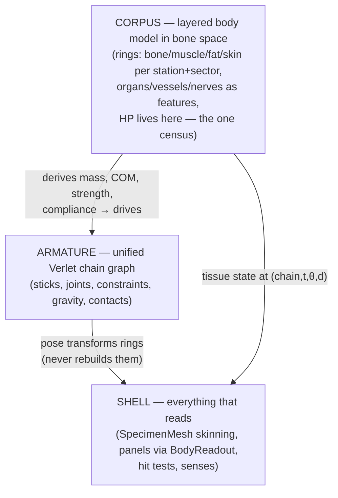

# Evolution v2 — Unified Body Design & Implementation Plan

**Status:** Draft for review · **Reference animal:** domestic cat · **Scope:** replaces AnatomyLattice + TissueGrid + the three partial skeletons with one unified body model; keeps the UI shell and the locomotion behaviour.

---

## 1. Goals

1. **One model.** What is hit is exactly what is displayed. Physics, damage, mass, and rendering all read the same structure; there is no translation or mirroring step anywhere.
2. **Simpler physics.** One chain system (spine + neck + tail + limbs), one gravity, one centre of mass, one integrator.
3. **Performance.** Cost scales with *segments and rings*, never with *volume in cells*. Damage is written once in body space; posing never re-carves anything.
4. **Elegance.** Biology is data, physics is process. A creature is one resource file; every physical behaviour (mass, power, compliance, wound response) is *derived* from that file, never authored twice.

### Laws carried over from v1 (learned the hard way, non-negotiable)

- **One owner per quantity.** One gravity/integrator, one centre of mass, one mass census. If two systems disagree about a number, the design is wrong, not the tuning.
- **Fix the mechanism, not the look.** "Looks off" means the rendering is lying about the state.
- **Nothing pose-derived in build inputs.** The body model is built from rest-pose data only; the live pose only *transforms* it. (This is what made carving re-fire 16 ms mid-gait in v1 — in v2 it is impossible by construction, keep it that way.)
- **Requests vs. delivery.** Speed is what the legs deliver; thrust derives from push and fades with effort. No hidden acceleration parameters, no reading solved-gait state to compute drive.
- **Tests state claims, not constants.** Calibrated numbers are re-pinned per body; the claim ("Froude quotes stance height", "stride ≤ plan reach") is what's ported.

---

## 2. Architecture overview

Three layers, strictly one-directional reads:



- **Armature** replaces: Spine.gd's Verlet core + Limb joint chains + Stature's neck arc + Ragdoll — one graph of sticks and joints.
- **Corpus** replaces: AnatomyLattice + TissueGrid + TissueForm + BodyShape + the census halves of Physique/Plumb. It is *the* census: mass, damage, and shape are the same numbers.
- **Shell** keeps: SpecimenMesh's ring-skinning approach (now reading Corpus directly), the HUD dock and drawers, CreatureView draw order. Panels are ported onto a small `BodyReadout` interface (§8).

The key structural change from v1: **the census moves from world space to body space.** v1's lattice was cartesian cells in the posed world, so posing moved flesh, carving was pose-sensitive, and damage had to be mirrored between two grids. v2's census is polar cells (station × sector × layer) attached to chain segments. Cells never move in body space; posing is just placing ring frames along the posed chain. Carving happens once, at build. Damage writes into the same cells that mass and rendering read.

---

## 3. What "schema" means, concretely

The schema is the answer to: *what fields, at what resolution, in what coordinate system, are the authoritative description of a creature's body?* Everything else in the game is either a process that updates those fields (physics, damage) or a view that reads them (mesh, panels, senses). Getting it right first matters because every phase of the rebuild reads it; changing it later means re-touching every phase.

It has five parts, each specified below with options where there is a real choice:

1. The **chain graph** — which chains exist, how many nodes each has, how they attach (§4).
2. The **ring model** — how cross-sections and tissue layers are represented along each chain (§5).
3. The **feature set** — organs, vessels, nerves as coordinates in body space (§6).
4. The **derivations** — how mass, COM, strength, compliance fall out of 1–3 (§7).
5. The **authoring format** — the single file a creature is tuned from (§7.5).

---

## 4. Schema part 1 — the chain graph

### 4.1 Dimensionality — DECISION

The v1 spine is a 2D plan-view chain (`PackedVector2Array`) with heights carried per-cell, and all the gait mathematics (stride discs, plan reach, sway budget, Froude) is plan-view math.

- **Option A — full 3D Verlet.** Nodes are `Vector3`, constraints solve in 3D. Cleanest on paper; but every piece of ported locomotion math (stride/stance/sway share one plan disc, posture-tilt foreshortening, plan-limit caps) must be re-derived, and 3D chain stability under ground contact is a research project of its own.
- **Option B — 2.5D (recommended).** Nodes are `Vector3` where XY is the plan and Z is height, but constraint solving is plan-dominant: distance/angle constraints act on the plan projection exactly as v1's solver does, while Z is governed by the stature/terrain channel (stance height, clearance, terrain, leaps, head carry). This is what v1 already converged on ("posture and height are one angle", "heights live on cells") — v2 just makes the Z channel a first-class per-node value on the chain instead of a per-cell afterthought.

**Recommendation: Option B.** All bite/combat addressing is still fully 3D (§9) because ring frames are 3D; only the *constraint solver* stays plan-dominant. Revisit full 3D only if a future feature (climbing, swimming rolls) demands it.

### 4.2 The graph for the cat reference

One rooted graph, six chains. Node counts are **functional stations, not vertebrae** — see 4.3.

| Chain | Nodes | Attaches at | Notes |
|---|---|---|---|
| `trunk` | 8 | — (root chain) | pelvis → sacrum → lumbar ×2 → thoracic ×3 → withers. Carries both girdle frames. |
| `neck` | 4 + head node | trunk[withers] | cervical arc; head node carries the jaw frame (bite origin). Successor of Stature's neck arc — the carry projection becomes ordinary chain posing. |
| `tail` | 6 | trunk[pelvis] | free Verlet follower; graded bend limit (v1 lesson: grade the bend, don't damp per-station, or the tail pumps the undulation). |
| `limb FL/FR` | 4 | trunk[withers − 1] | scapula-pivot → elbow → wrist → toe. Cats are digitigrade: the 4th node is the metacarpus/paw, which is what actually makes cat legs read right. |
| `limb HL/HR` | 4 | trunk[pelvis] | hip → knee → hock → toe. Hock (ankle) sits high — this is the cat's "backwards knee". |

Total: **~32 nodes / ~28 sticks**. That is the entire physics skeleton.

Per **node**: `pos: Vector3`, `prev: Vector3` (Verlet), `frame` (forward/perp/up, computed).
Per **stick**: `rest_length`, `bone_radius` (the rigid core the rings wrap, §5), `bone_break_hp` (optional, late).
Per **joint** (node with ≥2 sticks): cone limit (min/max bend in plan, as v1's `_solve_angle_symmetric`), stiffness, and for limb joints the FABRIK role. The tendon-insertion gearing (swing vs. push trade at 0.30 no-op) ports as a joint property.

Girdle attachment gets one extra scalar worth keeping from cat anatomy: the forelimb girdle is **muscle-slung** (cats have no functional clavicle — the scapula floats). Model as attachment compliance: hind girdle rigid to trunk, fore girdle a stiff spring. This is one number, it is what makes a cat's front end absorb landings, and it feeds soft-landing behaviour for free.

### 4.3 Station density — DECISION

- **Option A — per-vertebra** (7C + 13T + 7L + 3S + ~21Cd ≈ 50 spine nodes): anatomically flattering, but triples solver cost for no behavioural gain; v1's whole gait repertoire runs on far fewer stations.
- **Option B — functional stations (recommended):** the ~32-node graph above for *physics*, with **render rings interpolated** between stations (Catmull-Rom along the posed chain, exactly how `Spine.sample(t)` already yields frames at arbitrary t). Physics cost stays fixed while visual smoothness is a free dial (`RINGS_PER_STICK`, start at 3).

**Recommendation: Option B.** The chain is a *controller*, not a vertebral census; smoothness belongs to the sampler.

---

## 5. Schema part 2 — the ring model (the census)

This is the heart of v2 and the direct replacement for both grids.

### 5.1 Coordinates

Every point in a creature's flesh has a **body address**:

```
(chain, t, θ, d)
  chain : which chain            t : arc position along it [0..1]
  θ     : angle around the axis  d : depth from the surface inward
```

Body addresses are stable under animation — a wound on the left flank stays on the left flank through every gait cycle, because the address is in bone-local frame. Converting a world-space contact point to a body address is: nearest point on posed chain (capsule test, as v1 `hit_test`/`aim_contact` already do) → two dot products and an `atan2`. This is the coordinate attacks target in 3D.

### 5.2 Discretization

The census quantizes body addresses into **polar cells**:

```
cell = (chain, station, sector, layer)
  station : fixed subdivisions along each chain   (trunk 16, neck 6, tail 8, limbs 6 each)
  sector  : fixed angular wedges around the axis  (trunk/neck 10, tail 6, limbs 6)
  layer   : BONE=0, MUSCLE=1, FAT=2, SKIN=3       (radial order, per the cat: muscle
            is bound to the skeleton and drives it; fat wraps muscle; skin wraps fat)
```

Cat total: 16·10 + 6·10 + 8·6 + 4·6·6 = **412 columns × 4 layers ≈ 1 650 cells.** Compare thousands of dense cartesian cells in v1, most of them interior filler. Every v2 cell is *meaningful* — it is a wedge of a specific tissue at a specific place.

Per cell, two numbers:

- `thickness` — radial extent of that tissue in that wedge, **at build** (rest anatomy).
- `hp` — current integrity ∈ [0..1]. **This is the entire damage state.** TissueGrid's ledger role collapses into the census; the damage translation step ceases to exist. Effective thickness = `thickness × hp` (a chewed-away wedge is thinner, so the mesh dents, the mass drops, and the next bite lands deeper — all automatically, because they all read this cell).

The surface radius of column (station, sector) is `bone_radius + Σ thickness·hp` over layers. Rings for rendering, capsules for contact, and depth for wound resolution are all this one sum.

### 5.3 Authoring representation — DECISION

Nobody should hand-author 412 columns. The question is what the *tuning* representation is, compiled into cells at build:

- **Option A — raw cells.** Author the full arrays. Maximum control, unmaintainable, and every physique tweak is a 400-number diff. Reject.
- **Option B — elliptical layers per station.** Per station, per layer: `(rx, rz, ventral_offset)`. Compact (~16 numbers/station), smooth, and captures the real asymmetries (deep chest = ventral offset at thoracic stations; belly fat hangs low = fat layer ventral offset). Wounds still live per-sector on top.
- **Option C — knot profiles (recommended, = v1's proven pattern).** Author sparse **knots** along each chain — exactly the `tail_base/tail_length/neck_width/trunk_lift` pattern the silhouette system already uses, extended per layer: e.g. muscle knots at shoulder/loin/thigh, fat knots at scruff/belly/inguinal, skin near-uniform with a scruff bump. Knots → interpolated per-station elliptical layers (Option B's form) → quantized into sector cells. Three levels: **knots (authored) → stations (compiled) → cells (census)**.

**Recommendation: Option C compiled through B.** Authoring stays at ~10 numbers per tissue per chain; the census stays uniform for the machine. The compile step is the successor of the carve — but it runs in microseconds, from rest-pose data only, exactly once per physique change.

### 5.4 The cat layout (initial knot set)

Values are proportions of trunk length / local bone radius; exact numbers get pinned by the Phase-2 probe.

- **Bone:** thin sheath everywhere except: skull (head node bulge), ribcage (thoracic stations get a `rib_cage` flag — bone layer spans the whole sector ring, which is why flank wounds there stop at bone), pelvis, scapula plate on the fore-girdle station.
- **Muscle** (the mover — its volume is what strength derives from, §7): epaxial ridge along dorsal trunk sectors; **hindquarters dominant** (thigh columns are the deepest muscle on the body — cats are rear-engined, matching v1's girdle-share model); shoulder/triceps mass on fore-limb upper stations; masseter/temporalis at the head node (bite force); tail and distal limbs nearly muscle-free (tendon-operated — which is *why* legs are light and swing fast; fast-twitch swing-time coupling survives).
- **Fat:** subcutaneous wash (thin, everywhere), inguinal/belly pad (ventral lumbar stations), scruff pad (dorsal neck). Leanness is one multiplier on the fat knot set.
- **Skin:** near-uniform thin; thicker + looser at scruff and dorsal neck (bite there grips skin before muscle — pre-modelled by the thicker skin+fat wedge).
- **Whiskers/claws/teeth:** not census tissue; features (§6) and Dentition port.

### 5.5 Thin parts

v1 lesson: parts under ~4 cells across have no interior — "sheathe, don't rewrite the census." The polar census obeys this natively: a thin part is simply columns whose muscle/fat thickness → 0, leaving bone + skin. No special case, no grid-parity floor. The v1 "thin conduits need a grid floor" rule dies here; conduits are features (§6) with their own radius, not census tissue.

---

## 6. Schema part 3 — features (organs, vessels, nerves)

Features are **not cells** — they are geometry in body coordinates, checked only when a wound reaches them:

```
Organ   : { name, chain, t_range, θ_centre, θ_spread, depth_band, hp, effect }
Vessel  : polyline of (chain, t, θ, d) + radius + flow_rate      (bleed on breach)
Nerve   : polyline + region_served                               (function loss on cut)
```

Cat placement (all on `trunk`/`neck`, t as fraction from pelvis→withers):

- **Heart** — thoracic t≈0.80–0.88, ventral, deep (inside rib bone layer). Successor of the `BodyState.arrested` organ; *death is a stopped heart* carries over verbatim.
- **Lungs** — thoracic t≈0.72–0.95, lateral pair, deep. Feed the aerobic ceiling (stamina = blood over engine).
- **Liver** t≈0.62–0.72 ventral-right; **stomach/gut** lumbar t≈0.35–0.60 ventral; **kidneys** t≈0.45–0.55 dorsal pair.
- **Aorta/vena cava** — ventral to the spine bone layer, full trunk run; **carotid/jugular** — neck, ventral-lateral, *shallow* (this is why throat bites kill — the schema encodes it as geometry, no special case); **femoral** — inner thigh proximal stations.
- **Spinal cord** — dorsal, *inside* the bone layer (protected until vertebra breached).

Wound resolution: bite resolves depth `d` through the column's layers (skin→fat→muscle→bone, subtracting `thickness×hp` in order, damaging each) → surviving depth intersects features in that (t, θ) neighbourhood → vessel breach starts bleed, organ hit applies its effect. The vessel/nerve *overlays* in the anatomy view render these polylines directly — same data, no TissueForm re-derivation.

---

## 7. Schema part 4 — derivations (biology → physics)

All read-only functions of the census; each has exactly one owner.

1. **Mass** — Σ over cells: wedge-shell volume (closed-form frustum sector between inner and outer radius, along the stick) × tissue density (bone 1.9, muscle 1.06, fat 0.92, skin 1.1 rel.) × hp. Owner: `Corpus.mass()`. Per-node masses feed the solver so a heavy head actually droops the neck chain.
2. **Centre of mass** — same summation, position-weighted, in body space; posed through ring frames per tick (cheap: 32 node masses, not 1 650 cells — cells bake to per-node mass + offset at compile). Owner: Plumb's successor `Poise`. Support polygon/stability logic ports as-is.
3. **Strength** — muscle cells only, grouped into **compartments** — DECISION:
   - *Option A — per-joint muscle accounting.* Anatomically pure, but v1 already proved the per-girdle abstraction carries the whole gait repertoire.
   - *Option B — compartments (recommended):* `fore_girdle`, `hind_girdle`, `epaxial` (spine power — leaps, gallop flex), `neck`, `jaw`. Each = Σ muscle volume of its stations. Girdle-share, drive, bite force, spine power all fall out. Maps 1:1 onto v1's `girdle_muscle`/`girdle_drive`, so Locomotion ports with a renamed input.
4. **Load & girth** — supported mass per limb from COM position (v1 logic); girth per station = mean surface radius, feeding the load^0.4 relation and silhouette width.
5. **Compliance (the soft-body feel)** — per column: `fat/(muscle+bone)` thickness ratio → contact stiffness + damage attenuation. A fat flank dents (visual ring deformation, §10) and cushions; a bony shin is stiff and fragile. **This is the whole soft-body system** — no soft-body dynamics, softness is a material property of contacts (see §9.1).
6. **Stamina** — aerobic ceiling from heart size (organ), lung capacity (organ), and locomotor muscle mass; v1's blood-over-engine model unchanged, inputs now from Corpus.

### 7.5 Schema part 5 — the authoring file

One `.tres` resource per creature (successor of CreatureParams' physique half):

```
CatBody.tres
├─ chains        : node counts, stick lengths, bone radii, joint limits, girdle compliance
├─ tissue knots  : per chain × layer, the §5.3 knot lists
├─ features      : organ/vessel/nerve table (§6)
├─ fibre         : fast_twitch, tendon insertions, spine_freedom  (behavioural scalars kept from v1)
└─ posture       : stance datum, tilt, stance_range               (Stance/Posture inputs)
```

"Properties adjustable from a single location" = this file. The Creature Creator's sliders write knot multipliers here (leaner ↓fat knots, bulkier ↑muscle knots, longer-limbed ↑stick lengths) and everything downstream re-derives. **Pin the default build exactly:** the compiled default cat's mass/strength/COM go into reference constants at 6+ decimals, with a probe asserting the fixed point (v1's 0.3%-drift lesson).

---

## 8. The `BodyReadout` interface (what "keep the UI" means)

The HUD shell survives untouched: HudDock, drawers, camera-focus-pays-for-drawers, MinimalSlider, PipMeter, InkToggle, F3 cycle. The content panels currently read the lattice; they get ported one drawer at a time onto one read-only interface:

```gdscript
class_name BodyReadout   # implemented by the v2 creature; panels depend only on this
func mass() / strength(compartment) / stamina_state() / gait_state()   # GaitPanel
func surface_radius(chain, station, sector) -> float                   # SpecimenMesh rings
func tissue_at(chain, t, theta) -> Array   # [(layer, thickness, hp), …] AnatomyView probe
func features_in(chain, t_range) -> Array  # organ/vessel overlays
func wounds() -> Array                     # damage listing, BiteMark visuals
func vitals() -> Dictionary                # heart/lungs state — "death is a stopped heart"
```

Panel-by-panel: **GaitPanel** stays a live view quoting measured gait state — same fields, new provider. **AnatomyView/AnatomyPanel** lose their lattice-walking code (the bulk of AnatomyView's 2 752 lines) and instead render rings + feature overlays — a substantial internal rewrite behind an unchanged visual design; the .dc.html mocks remain the layout spec (take the layout, take the numbers from the live systems). **CreatureCreator** sliders write the authoring file. **SpecimenMesh** is the big winner: its ring/band machinery stops *deriving* rings from a cell census and reads them directly — bands, sectors, gap-fill logic simplify or vanish.

---

## 9. Combat, damage, contacts

### 9.1 Contacts
Creature–creature and creature–world contact = **capsule vs. capsule on posed sticks** (radius = mean surface radius of the stick's stations). ~28 capsules/creature, broad-phase by chain AABBs — the v1 "bound the overlap first" lesson, now with no per-cell lookups at all behind it. Contact response: positional correction into the Verlet nodes, stiffness scaled by local compliance (§7.5). Softness = the flank *gives* (nodes displace, rings dent visually) instead of bouncing.

### 9.2 Bites and targeted attacks
The v1 bite pipeline survives structurally — one 3D contact point, hover-preview → click-commits, lunge as rigid body shift capped by support, reach measured from rest pose, verticals gate before horizontals, underbody bites anchored at the jaws. What changes is the *addressing*: `hit_test` resolves to a body address `(chain, t, θ)`; wound application is §6's depth walk. TargetMark/Reticle/BiteCue keep working on the contact point; Mouthful/Dentition port with tooth depth mapping straight onto layer thickness.

### 9.3 Wounds
A wound is *only* hp reduction on cells (+ feature effects). No separate wound object for physics — BiteMark keeps cosmetic state (tooth pattern) but reads geometry from the census. Bleed = flow_rate accumulation on breached vessels into BodyState's blood pool (stamina and death already hang off blood/heart — unchanged).

---

## 10. Rendering

- **SpecimenMesh v2:** for each render ring (interpolated station, §4.3), place the ring frame on the posed chain, radius per sector from the census, skin adjacent rings into tube quads; limb tubes off limb chains (limb flesh lives on the drawn chain — already true in v1). Band by axis where sticks bend sharply (v1 lesson). Wounds render as *the same rings, thinner* — dents appear because the data got thinner, plus a BiteMark material decal for the surface look.
- **Layer peel** (anatomy view): render rings at bone-only, +muscle, +fat, +skin radii — the peel view is four evaluations of the same sum, no second geometry system.
- **Contact dent:** transient sector-radius offsets decaying over ~0.3 s, driven by contact impulses × compliance — purely visual, never written to the census.
- Draw-cost lessons carry: bank shades per (layer, hp bucket), hoist packed arrays, cull before working.

---

## 11. Implementation strategy

### 11.1 Ground rules

- **Build alongside, never in place.** `scripts/creature2/` + `scenes/V2Lab.tscn` (minimal Main: camera, terrain, input pump, one v2 creature). v1 keeps running as the executable spec/oracle for gait feel, silhouettes, and bite behaviour.
- **Do not strip v1 first.** Deletion is one commit at the end (Phase 7), an afternoon; stripping first is a month of working blind with the reference destroyed.
- **Port claims, not constants.** Every v1 test that survives is re-expressed against the cat body with freshly pinned numbers.
- **Harness lore still applies:** new `class_name`s need `--import` before headless tests see them (and the errors point at the wrong files); failing script tests hang — never pipe to `tail`; RenderSmoke draw counts are not a signal; profiling needs manual ticks (PerfProbe pattern); UI screenshots need a windowed SceneTree script.

### 11.2 Phases

Each phase has a **gate** — a probe or test that must pass before the next phase starts. Rough sizing assumes v1's actual line counts as the porting base.

**Phase 0 — Scaffold (small). ✅ COMPLETE (2026-08-11)**
`scripts/creature2/`, `V2Lab.tscn`, `CatBody.tres` stub, schema constants file (station/sector counts, layer enum, densities). Gate: lab scene opens, headless import clean.
*Done as: `BodySchema.gd` (layers, densities, station/sector counts, ring dial), `BodySpec.gd` (authoring resource — class defaults are the reference cat, so `CatBody.tres` is a plain instance overriding nothing), `scenes/V2Lab.tscn` + `V2Lab.gd` (camera, terrain, input pump: zoom/reset/collapse/drop/node-drag). Gate passed: import registers all creature2 classes clean, scene opens headless exit 0.*

**Phase 1 — Armature (the skeleton core). ✅ COMPLETE (2026-08-11)**
`Armature.gd`: node/stick/joint graph, Verlet step, plan-dominant constraint solver (port `_solve_distance_symmetric` / `_solve_angle_symmetric` from Spine.gd — they are chain-agnostic already), Z channel, Gravity as sole integrator, FABRIK for limb chains (port Fabrik.gd), ragdoll = constraints-loosened mode (replaces Ragdoll.gd).
Gate: `ArmatureProbe` — cat graph stands under gravity, joint limits hold, drop test settles, per-node mass droop visible on neck/tail. Claims from GravityTest/RagdollTest.
*Done as: `Armature.gd` (35 nodes / 34 sticks in six chains; the whole axial body — tail→trunk→neck→head — is one relaxation sequence to the solver while Chain objects keep per-chain addressing; symmetric solvers and FABRIK ported verbatim; live limbs placed by sagittal-plane FABRIK so bone lengths are exact in 3D; Z channel = stance heights + carry lines + the Droop beam-law walk reading provisional per-node masses that Corpus takes over in Phase 2; `Gravity.Fall` is the only vertical integrator) and `Creature2.gd` (lab node, honest debug draw). Gate passed — `tests/ArmatureProbe.gd`: stands at what the legs deliver (pelvis 30.8 / withers 25.1 px), 160 px drop lands in 0.47 s per the world's closed form and stands back up, bends legal under a hard tail-haul with sticks exact to 0.0004 px on release and the body towed by the pull, tail sags 4.98 px in a tip-steepening curve clear of the floor, a 1.4× skull deepens neck sag 0.473→0.732 px, collapse lies flat with anatomy intact and rests drift-free. v1 oracles GravityTest/RagdollTest still green alongside.*

**Phase 2 — Corpus (the census). ✅ COMPLETE (2026-08-11)**
Knot compiler (knots → station ellipses → sector cells), `Corpus.gd` cell arrays + surface-radius/mass/COM/compartment derivations, `Poise.gd` (Plumb successor: bake cells → per-node mass+offset, posed COM, support polygon — port hull/stability math), feature table, `CatBody.tres` fully authored per §5.4/§6.
Gate: `CorpusProbe` — prints mass, COM, compartment strengths, per-station girth for the default cat; values pinned to 6 decimals as the reference constants. Claims from PlumbTest/VolumeTest/AnatomyTest. *(The pins below are Phase 2's; the trunk and neck knots were thickened at Phase 4 when the silhouette was first measured, and everything off the cells was re-pinned — see that phase's note.)*
*Done as: `Corpus.gd` (the one census — §5.3 C compile, knots → per-station ellipses with a ventral-hang term → 412 columns × 4 layers ≈ 1 650 cells; surface radius = core + Σ thickness·hp so ring, capsule and wound depth are one sum; mass/COM/five compartments/girth/compliance derived in one revision-keyed walk that also leaves per-station moments for the bake; `gouge` is the outside-in tissue depth-walk, feature intersection deferred to Phase 5; `features_in` serves the §6 table), `Poise.gd` (census → per-node mass/rise/lean/beam-width, split linearly between bracketing nodes so the first moment is exact; hands `Armature.mass`/`flesh_r` their numbers — the provisional flesh-scale derivation is deleted; posed COM is one weighted mean per tick; support hull/clearance/steadiness ported from Plumb verbatim), tissue knots + organ/vessel/nerve table authored as `BodySpec` class defaults (`CatBody.tres` still overrides nothing). Gate passed — `tests/CorpusProbe.gd`: fixed point pinned to 6 decimals (mass 30523.043797, COM x 30.110855 / z 25.734169, along 0.485659, compartments fore 1119.39 / hind 2242.16 / epaxial 4540.99 / neck 814.08 / jaw 395.97, mean trunk girth 7.596613); a heavy tail moves the weight 0.087 aft on a fixed ruler and a 1.8× skull moves it fore; dorsal muscle lifts the centre off the chain line; paw and tail tip are sheath over bone with no grid floor; hindquarters out-muscle the fore girdle 2:1; ribcage wraps the heart, skull wraps the brain, carotids shallow over a deep aorta; a gouge dents the surface by exactly the flesh it took; the standing armature poses its weight 9.7 px inside its own four feet with posed and built centres agreeing; and a chewed haunch re-bakes once — lighter, weight fore and to the other side, pelvis node lighter — with no carve and no mirror anywhere. ArmatureProbe still green on census-baked masses; v1 oracles PlumbTest/VolumeTest/AnatomyTest green alongside.*

**Phase 3 — Locomotion (the big port). ✅ COMPLETE (2026-08-12)**
Gait.gd (1 981 lines — port, don't rewrite: patterns, duty factors, rotary-gallop spine threshold), Locomotion (push-derives-and-fades drive, swing floor, fast-twitch coupling), Footfall, Stance/Posture (two-axis model, RULES table), Balance, Leap/Jump, Traversal — all reading Armature nodes + Poise + Corpus compartments instead of v1 structures. Stride/stance/sway still share one plan disc.
Gate: `SprintProbe`/`GaitProbe` v2 — walk/trot/gallop stable on terrain, Froude off stance height, measured top speed = stride/cycle delivery. Side-by-side eyeball vs. v1 in the lab. This phase is where "keeps the locomotion behaviour" is proven.
*Done as eight files. `Carriage.gd` merges Posture and Articulation, because they were one fact split in two — how far the limbs are carried out of the ground plane and how straight the joint between their bones is carried are the same statement about a skeleton — so the table, the three joint angles, the tendon lever and every projection live together, and `stance_clearance` is the single closed form both the census's rest datum and the live gait read (v1's `stance_factor` is deleted: a limb is a joint angle, per girdle). `Attitude.gd` is Stance's successor — two axes, the RULES table, hysteresis in pace and in time, `rest` for the census and a mutated `active` for the live world. `Locomotor.gd` derives power (locomotor muscle at the area power over mass, both off the census, so the reference cat is exactly 1.000 and `REFERENCE_MASS`/`REFERENCE_MUSCLE` are pinned beside CorpusProbe's), the push that fades with speed, duty, stride, excursion, stance limit, swing time, leg speed and the spine's bunch. `Cadence.gd` is Footfall ported whole — three numbers, Froude off the stance hip, launch, aerial, lift limits, beats. `Tread.gd` is Gait's successor (`Tread.Foot` carrying the gait half of v1's Limb; the armature owns the bones): retarget, one shared stride, the pattern, step arcs with the fold tuck, the beat contest, the body carried down onto its feet per corner, and the feet handed to the armature. `Bound.gd` is Leap and Jump in one file — capability and arc are the same arithmetic read at two moments, and the take-off hands its speed to `Armature.fall`, the world's one integrator. `Footing.gd` is Balance, reading per-limb soundness off the census. `Crossing.gd` is Traversal's four verdicts off six measurements of the solved body.*
*The armature gained what a driven body needs: a head-pinned solve (corrections flow away from the pin, soft passes at `spine_stiffness`, the last pass exact), the travelling lateral wave as pure displacement, girdle heights the gait measures rather than the spec asserting, per-limb foot targets solved in the vertical plane through socket and foot, `bunch` folding the trunk's plan rests, and `launch`/`rotate_followers`/`station_behind_head`. Corpus gained `soundness`/`girdle_soundness` (effective muscle over built, exactly 1.0 intact) and `balance`; Poise gained the three balance constraints ported from Plumb.*
*Gate passed — `tests/GaitProbe.gd`: the cat stands at shoulder 33.8 / hip 36.7 px measured off four planted feet (the v1 oracle's Cat: 33.7 / 36.2) with no drift; planted feet creep 0.0000 px a tick at every settled pace; flat out at 132 px/s it covers 30.8 px a cycle on 26.2 px of foot travel and never outruns `leg_speed`; the pattern comes out of the speed — lateral-sequence walk on 3.25 feet down, trot on 2.62, transverse gallop on 2.30, duty falling the whole way; a 14.8 px crouch leaves the regime at 0.0507 off the stance hip where the crouch would say 0.0878; the same body either side of `Cadence.ROTARY_SPINE` gallops transverse or rotary; one stride of 19.0 px with both girdles turning over in 0.299 s; a chewed thigh strides 15.1 px against 19.0 and swings 133 ms against 99, and chewed hollow it stops stepping and is dragged; a charged leap clears 93 px of the 97 it was priced at and lands on its feet; 1320 px of ledges leaves every bone, stick and joint exact. `tests/PushProbe.gd` is SprintProbe's successor and prints the calibration: 518 px/s² (0.345 g), half the top speed in 0.10 s and nine tenths in 0.22 s walking, 0.17/0.42 s sprinting. ArmatureProbe and CorpusProbe re-pinned — the rest stance is the joint angles' answer now, so the census's rest frame rose (COM z 25.73 → 32.20) while mass and every compartment held to the last decimal — and the v1 oracles LocomotionTest / FootfallTest / StanceTest / TraversalTest / MovementFeelTest are green alongside.*

**Phase 4 — Skinning. ✅ COMPLETE (2026-08-12)**
`SpecimenMesh2`: rings from census via interpolated stations; CreatureView port (draw order, shading banks); silhouette check against the Gait HUD .dc.html geo blocks (still the spec).
Gate: screenshot probe — standing/walking cat silhouette matches v1/mock within tolerance; RenderBenchmark comparison (expect a large win; don't trust single runs).
*Done as two files. `Contour.gd` is SpecimenMesh2 under a name that says what it turned out to be: not a mesh for the specimen panel but **the** geometry, the census's flesh placed on the solved chain, and every view is a projection of it rather than a second surface. Rings are laid `BodySchema.RINGS_PER_STICK` to a stick — 97 of them, splined through the armature's nodes on the axial line and straight along a limb's bones, because a back is a curve between its stations and an elbow is a corner — and each ring's sector radii are `Corpus.surface_radius` interpolated between the two stations bracketing it. Three resolutions meet and stay distinct: ~35 physics nodes, the census's fixed stations where damage is bookkept, and the rings, which are the sampler's business and cost the simulation nothing. The frame is the honest part: the lateral comes off the armature's own plan frames (a leg hanging straight down has no plan direction of its own) and dorsal is completed per chain, so a wound on the right of the tail is drawn on the right of the tail. Radii are re-read only when `Corpus.revision` moves; a tick poses frames and evaluates surface points and touches no cell. `Corpus.layer_radius` is new and `surface_radius` now calls it — the peel is four evaluations of one sum (§10), with no second geometry under the skin.*
*`Likeness.gd` is CreatureView's port: v1's draw order (limbs, body over them, paws over that), its palette and its batching lesson (four triangle arrays, shades banked per layer and wear, buffers allocated once, the ink re-read only on a wound). Two things are gone rather than ported. The attitude shear is gone — v1 drew the body as one flat sheet at one height and had to tip the sheet to say a leg was holding a corner lower, where every v2 vertex carries its own height and the projection is one line, `y − z · PERSPECTIVE`. And the wound is gone as a thing to draw: a chewed wedge is thinner and a different colour because the census says so, so the picture cannot disagree with what was bitten. Within a ring the sectors are painted ventral-first, since from almost overhead a ring projects to a sliver and both its sides land on the same pixels; shadows are cast from the plan silhouette between the flank sectors rather than from the tube, because overlapping sectors stack their ink.*
*The gate found something, which is what a gate is for. Every stance proportion was already exact — shoulder 0.61 and hip 0.69 of the girdle gap against the mock's 0.64/0.68 — but the drawn animal was 0.27 of its own gap across the trunk where the Gait HUD mock says 0.38 and v1's Cat preset says 0.47: a third too thin, and it read as a weasel. That is Phase-2 authoring rather than skinning, and nothing had measured it before, because a census is self-consistent whatever the knots say. So the trunk and neck knots were thickened until the drawn cat sat inside the reference band (girth 0.40, head 0.33), the tail tip's width moved from mover into skin to keep the thin-part claim true, and everything counted off the cells was re-pinned in the same commit: mass 30523.043797 → 46128.100637, COM (31.98, 0, 33.47), along 0.516, epaxial 11985.78, and `Locomotor.REFERENCE_MASS`/`REFERENCE_MUSCLE` with them — after which the reference cat is exactly power 1.000 again and PushProbe prints the same 518 px/s² (0.345 g) it did before. The limbs and the tail were measuring right and were left alone.*
*Gate passed — `tests/SkinProbe.gd`: 97 rings and 724 facets cover all 412 census columns with no station undrawn; the sampler matches the census to 1e-6 px at every station centre and every surface point sits on its own radius; the peel never takes the body outward and its fourth evaluation is the surface exactly; 300 walked ticks move no cell, re-read no radius and leave no ring more than 0.33 px off its stick; a 3.5 px bite dents the drawn ring by exactly 3.5 px and the wedge is drawn as meat; the mesh is the same 724 facets whole or chewed. `tests/SkinBench.gd` is the RenderBenchmark comparison (RenderBenchmark itself measures the whole game scene and cannot see v2 until Phase 7): v1's view rebuilds and recolours 344 quads every frame at ~685 µs, v2 poses, projects and shades 724 facets at ~240 µs, and the scaling claim is the real win — v1's census is 3 274 cells for a cat and 49 088 for an elephant, where v2's is 1 648 for either, because the resolution is a statement about the surface rather than about the volume behind it. `tests/SkinShot.gd` is the eyeball half, windowed: standing, walking, sprinting and collapsed. ArmatureProbe, CorpusProbe, GaitProbe and PushProbe re-run green on the re-pinned body.*

**Phase 5 — Damage & combat.**
Capsule contacts + compliance response; body-address `hit_test`; wound depth-walk; features (bleed, organ effects, arrest); Mouthful/Dentition/BiteMark port; lunge/strike pipeline rewired (TargetMark, Reticle, BiteCue keep their roles); Grip/feeding.
Gate: CombatTest/BiteReachTest/FeedingTest claims re-expressed — bite anchors at jaws, wound depth matches tooth/layer math, throat bite bleeds, heart hit arrests, "what is hit is what is displayed" verified by biting a flank and diffing the rendered ring against the census.

**Phase 6 — UI port.**
`BodyReadout` implemented on the v2 creature; drawers ported one at a time (suggested order: GaitPanel → SpecimenMesh view → AnatomyView/AnatomyPanel → CreatureCreator → EvolutionHUD vitals). Shell untouched.
Gate: F3 cycle fully working against v2 in the lab; UIInteractionTest claims (note: the sphere-drag checks were already red on clean v1 main — do not chase them as regressions).

**Phase 7 — Cutover & deletion.**
Main spawns the v2 creature; senses/world hooks (ScentField, CarrionField, SoundField read positions/masses — thin adapters); one commit deletes `scripts/creature/` v1 files + lattice-era tests; remaining tests re-pinned; memory/docs updated.
Gate: full game session parity — spawn, walk, hunt, bite, feed, die.

### 11.3 Sequencing notes & risks

- **Phases 1–2 are deliberately small and gate everything.** If the schema needs a change, it must happen before Phase 3 starts consuming it.
- **Phase 3 is the schedule risk** (biggest port, subtlest behaviour). Mitigation: the v1 oracle running side-by-side, and porting Gait's tables verbatim before touching its inputs.
- **Two creatures of code coexist for the whole rebuild.** Class-name collisions are the practical annoyance — suffix v2 classes (`Armature`, `Corpus`, `Poise`, `SpecimenMesh2`…) and never reuse a v1 class_name until Phase 7's deletion.
- **Scope discipline:** no new features during the rebuild (no climbing, no new senses, no extra species beyond the cat). Second species (retune knots, re-pin probe) is the *first post-v2 task* and the proof the authoring layer works.

---

## 12. Decisions taken in this draft (override here, before Phase 0)

| # | Decision | Chosen | Rejected |
|---|---|---|---|
| 1 | Chain dimensionality | 2.5D — Vector3 nodes, plan-dominant solving (§4.1 B) | full 3D solver |
| 2 | Station density | ~32 functional nodes; render rings interpolated (§4.3 B) | per-vertebra |
| 3 | Census structure | body-space polar cells (station × sector × layer), hp on cells (§5.2) | any world-space grid |
| 4 | Authoring | knots → station ellipses → cells (§5.3 C) | raw cells; ellipses only |
| 5 | Strength mapping | 5 muscle compartments (§7.3 B) | per-joint accounting |
| 6 | Soft body | material compliance on capsule contacts + visual dents (§7.5, §9.1) | soft-body dynamics |
| 7 | Rebuild mode | alongside in-repo, v1 as oracle, delete last (§11.1) | in-place; strip-first; fork |
